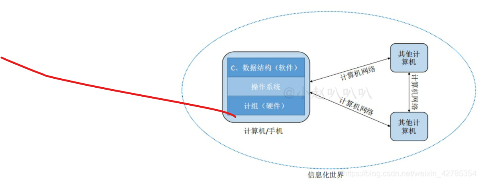

## 信息化时代

---

## 数据结构的基本概念

<!-- more -->

## 定义

在任何问题中，数据元素都不是孤立存在的，而是在它们之间存在着某种关系，这种数据元素相互之间的关系称为结构（Structure）。数据结构是相互之间存在一种或多种特定关系的数据元素的集合。数据结构包括三方面的内容：逻辑结构、存储结构和数据的运算。数据的逻辑结构和存储结构是密不可分的两个方面，一个算法的设计取决于所选定的逻辑结构，而算法的实现依赖于所采用的存储结构。

### 逻辑结构

- 逻辑结构是指数据元素之间的逻辑关系，即从逻辑关系上描述数据。它与数据的存储无关，是独立于计算机的

- 数据的逻辑结构分为线性结构和非线性结构
  - 线性结构 （线性表 栈 数字 队列 ）
  - 非线性结构
    -  集合
    - 树形结构
    - 图结构（网状结构）
    - 二维数组、多维数组、广义表

### 存储结构

存储结构是指数据结构在计算机中的表示（又称映像），也称物理结构。它包括数据元素的表示和关系的表示。数据的存储结构是逻辑结构用计算机语言的实现，它依赖于计算机语言。数据的存储结构主要有：顺序存储、链式存储、索引存储和散列存储。

- 顺序存储：存储的物理位置相邻。（p.s. 物理位置即信息在计算机中的位置。）
- 链接存储：存储的物理位置未必相邻，通过记录相邻元素的物理位置来找到相邻元素。
- 索引存储：类似于目录，以后可以联系操作系统的文件系统章节来理解。
- 散列存储：通过关键字直接计算出元素的物理地址（hash）。

### 算法的五个特征

- 1，有穷性：有限步之后结束
- 2，确定性：不存在二义性，即没有歧义
- 3，可行性：比如受限于计算机的计算能力，有些算法虽然理论上可行，但实际上无法完成。
- 4，输入：能被计算机处理的各种类型数据，如数字，音频，图像等等。
- 5，输出：一至多个程序输出结果

### 算法的复杂度

- 时间复杂度：
  - • 它用来衡量算法随着问题规模增大，算法执行时间增长的快慢；
  - • 是问题规模的函数：T(n)是时间规模函数 时间复杂度主要分析T(n)的数量级
  - • T(n)=O(f(n)) f(n)是算法中基本运算的频度 一般我们考虑最坏情况下的时间复杂度
- 空间复杂度：
  - • 它用来衡量算法随着问题规模增大，算法所需空间的快慢；
  - • 是问题规模的函数：S(n)=O(g(n)) ；算法所需空间的增长率和g(n)的增长率相同。

