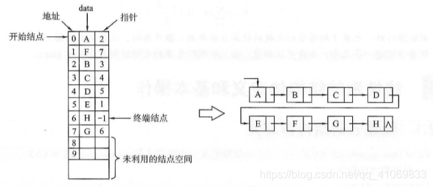

## 线性表

- 线性结构特点：在数据元素的非空有限集合中
  
  - (1)存在唯一的一个被称做“第一个”的数据元素；
  - (2)存在唯一的一个被称做“最后一个”的数据元素；
- (3)除第一个之外，集合中的每个数据元素均只有一个前驱；(4)除最后一个之外，集合中每个数据元素均只有一个后继。
  
- 线性表定义：有限个性质相同的数据元素组成的序列。

  <!-- more -->

- 线性表的存储结构：顺序存储结构和链式存储结构

> 顺序存储定义：把逻辑上相邻的数据元素存储在物理上相邻的存储单元中的存储结构。
>
> 通常用一维数组来描述数据结构中的顺序存储结构。

> 链式存储结构: 其结点在存储器中的位置是随意的，即逻辑上相邻的数据元素在物理上不一定相邻。通过指针来实现。

- 顺序表
  顺序表把线性表的所有元素按照其逻辑顺序，依次存储到从指定的存储位置开始的一块连续的存储结构空间中中。

- 链表
  在存储链表中，每个节点不仅包含所存元素的信息，还包含元素之间逻辑关系的信息。可以通过前驱结点中的地址信息找到后继结点的位置。

- 两者存储结构比较

  - 顺序表的特性：(其实就是数组)
    **随机**访问特性。
    占用**连续**的存储空间。
  - 链表的特性：
    **不支持随机访问**的特性。
    结点的存储空间利用率较顺序表稍微低一些。
    不需要一次性划分所有结点所需空间给链表。
  - 链表支持存储空间的动态分配。
    顺序表在做插入操作的时候需要移动多个元素
    链表进行插入操作无需移动元素

- 4.链表的5种形式

  - 1 单链表

    - 带**头结点**与**不带头结点**的区别：

    带头结点的单链表有一个结点不存储信息，而不带头结点的单链表所有结点都存储信息。

    

  - 2 双链表

    - 

  - 3 循环单链表

    - 环单链表可以实现从任一结点出发访问链表的任何结点，而单链表从任一结点出发后只能访问这个结点本身及其后边的所有结点。带头结点的循环单链表，***链表空***，head=head->next;不带头结点，**链表空**，head=NULL

      

  - 4 循环双链表

    - 循环双链表即终端结点的next指针指向链表中的第一个结点，将链表中第一个结点的prior指针指向终端结点

      

  - 5 静态链表

    - 静态链表借助一维数组来表示。静态链表来自于一个**结构体数组**，数组中每一个结点含有两个分量：一个数据元素分量data;另个一个是指针分量，指示了当前结点的直接后继结点在数组中的位置。

      

    

    ### 考研中遇到考顺序表和链表的比较：
    - 基于空间的比较

    1.存储方式的比较：

    顺序表的存储空间是一次性分配，链表的存储空间是多次分配。

    2.存储密度：(存储密度=结点值域所占存储量/结点结构所占的存储量)：

    顺序表的存储密度=1，链表的存储密度<1(因为结点中有指针域)

    - 基于时间的比较

    1.存储方式：

    顺序表可以随机存储，也可以顺序存储，链表只能顺序存储

    2.插入、删除时移动元素的个数:

    顺序表平均需要移动一半的元素；链表不需要移动，只需要修改指针。

    对顺序表平均需要移动近一半元素，链表不需要移动元素，只需要修改指针。

    具有n个元素的顺序表，插入一个元素所进行的平均移动个数是多少，

    1）求概率，是随机的，可能性相同，有n个可插入位置，所以任何一个位置被插入元素的概率为p=1/n；

    2）求对应于每个插入位置需要移动元素个数。

    假设要把新元素插入在表中第i个圆度之后，则需要将第i个元素之后的所有元素往后移动一个为置，因此移动元素个数为n-i。

    由1和2可知，移动元素个数的期望E为：

    E=n-1/2

    插入和删除算法的平均时间复杂度为O（n).

  #### 顺序表的定义

  ~~~c++
  > 1.线性表的顺序存储又称顺序表
  > 2.元素的逻辑顺序与物理顺序相同
  > 3.顺序存储结构是一种随机存储结构
  > 4.特点：
  > 	1）顺序表的随机访问：通过首地址和元素符号在O(1)时间内找到指定的元素
  >	2）储存密度高，每个节点只存储数据元素
  >	3）由于逻辑相邻与物理相邻，所以插入和删除操作需要移动大量的元素
  一维数组可以是静态分配的，也可以是动态分配的。
  #define MaxSize 50  //定义线性表的最大长度
  typedef struct{
  	ElemType data[MaxSize];   //顺序表的元素
  	int length;				  //顺序表的当前长度
  }SqList;					  //顺序表的类型定义
  
  动态分配时，存储数组的空间是在程序执行过程中通过动态存储语句分配的，一旦数据空间占满，就另外开辟一块更大的存储空间，用以替换原来的存储空间，从而达到扩充存储数组空间的目的，而不需要为顺序表一次性划分所有空间。
  #define InitSize 100  //表长度的初始定义
  typedef struct{
  	ElemType *data;   //指示动态分配数组的指针
  	int MaxSize,length;				  //数组最大容量和当前定义
  }SeqList;					  //动态分配数组顺序表的类型定义
  分配存储空间的语句
  C：	  L.data=(ElemType*)malloc(sizeof(ElemType)*InitSize);
  C++： L.data=new ElemType(InitSize);
  注意：动态分配并不是链式存储，物理结构没有变化，依然是随机存取方式，只是分配的空间大小可以在运行时动态决定。
  
  ~~~

  #### 顺序表的插入

  ~~~c++
  1.插入操作 【在顺序表L的第i（1<i<L.length+1）个位置插入新元素e】
  #define MaxSize 10
  typedef struct{
  	int data[MaxSize];
  	int length;
  }SqList;
  
  bool ListInsert(SqList &L,int i,ElemType e){
  	if(i<1 || i>L.length+1)  // 判断i的范围是否有效
  		return false;
  	if(L.length>=MaxSize)	//当前存储空间已满不能插入
  		return false;       
  	for(int j=L.length;j>=i;j--)  //将第i个即以后元素往后移
  		L.data[j]=L.data[j-1];
  	L.data[i-1]=e;   //在位置i放置e
  	L.lenght++;      //线性表长度+1
  	return true;
  }
  
  int main(){
  ................
  }
  注意：区别顺序表的位序和数组下标。为何判断插入位置是否合法时 if语句中用length+1，而移动元素的for语句中只用length？
  答：
  	1.首先明确，位序从 1 开始，数组下标从 0 开始；这里 i 是指 位序；
  	2.if语句：分析两种种情况(前提：线性表未满)：
  				1）length+2的情况：i的范围是[1，length+2],length+2所插入的位置在顺序表上是断档，违背顺序表定义（一组地址连续的存储单元逻辑上相邻的两个元素的物理位置上也相邻）
  				2）length的情况：i的范围是[1，length],顺序表上length+1位置是空的
  
  	3.for语句：到for语句时，说明至少有一个可插入的位置；
  			   j=L.length时，保证最后一个数组元素可以移到数组的后一个位置而不产生数组越界异常
  		
  2.在不同位置进行插入操作的时间复杂度（n为length）
  	1)最好情况：表尾插入（i=n+1），元素后移语句不执行，复杂度O(1);
  	2)最坏情况：表头插入(i=1)，元素后移语句执行n次，复杂度O(n);
  	3)平均情况：略，复杂度O(n);
  
  
  
  ~~~

  #### 顺序表的删除

  ~~~c++
  1.删除操作 【删除顺序表L中第i(1<=i<=L.length)个位置的元素，用引用变量e返回】
  #define MaxSize 10
  typedef struct{
  	int data[MaxSize];
  	int length;
  }SqList;
  
  bool ListDelete(SqList &L,int i,ElemType &e){
  	if(i<1||i>L.length)    //判断i的范围是否有效
  		reutrn false;
  	e=L.data[i-1];     //e保存将要被删的值
  	for(int j=i;j<L.length;j++)    //第i个位置后的元素前移
  		L.data[j-1]=L.data[j];
  	L.length--;
  	return true;
  }
  
  int main(){
  ................
  }
  2.在不同位置进行删除操作的时间复杂度（n为length）
  	1)最好情况：删除表尾元素(i=n)，元素前移语句不执行，复杂度O(1);
  	2)最坏情况：删除表头元素（i=1），元素前移语句执行n次，复杂度O(n);
  	3)平均情况：略，复杂度O(n);
  
  ~~~

  ####　按值查找

  ~~~c++
  1.按值查找（顺序查找）【在顺序表L中查找第一个元素值等于e的元素，并返回其位序】
  #define MaxSize 10
  typedef struct{
  	int data[MaxSize];
  	int length;
  }SqList;
  
  int LocateElem(SqList L,Elem e){
  	int i;
  	for(i=0;i<L.length;i++)
  		if(L.data[i]===e)
  			return i+1;
  	return 0;
  }
  
  int main(){
  ................
  }
  2.时间复杂度（n为length）
  	1)最好情况：查找的元素就在表头，仅需比较1次，复杂度为O(1);
  	2)最坏情况：查找的元素就在表尾，需比较n次，复杂度为O(n);
  	3)平均情况：略，O(n);
  
  ~~~

  ### 单链表的操作

  例题将AB，插入C中 归并，尾插

  

  

  ~~~c
  void merge(LNode *A,LNode *B,LNode *&C)
  {
   	LNode *P=A->next;//p来跟踪A的最小值结点。A->next表示A链表的开始结点（头结点后边一个结点），A链表是递增，所以最前面的是最小节点。
      LNode *q=B->next;
      LNode *r;//r始终指向C的终端结点
      C=A;//用A的头结点做C的头结点
      C->next=NULL;
      free(B);//B头结点无用，释放掉
      r=C;//r指向C，因此头结点是终端结点
      while(p!=NULL&&q!=NULL)//当p与q不空时，选取p与q所指结点中较小的插入c的尾部，
         //以下的if else语句中，r始终指向当前链表终端结点，作为接纳新结点的一个媒介，通过他，新节点被链接入c并且重新指向新的终端接点，以便接受下一个新节点，这里是尾插法的思想
      {
  		if(p->data<=q->data)
          {
              r->next=p;p=p->next;
              r=er->next;
          }
          else
          {
              r->next=q;q=q->next
                  r=r->next;
          }
      }
      r->next=NULL；
          //以下两个语句将还有剩余的结点的链表连接在C的尾部
          if(p!=NULL) r->next=p;
          if(q!=NULL) r-next=q;
  }
  ~~~

  **假设有n个元素已经存储数组a中，用尾插法建立链表c**

  ~~~c
  void createlistR(LNode *&C,int a[],int n)//要改变的变量用引用型
  {
  	LNode *s,*r;//s用来指向新申请的结点，r始终指向c的终端
      int i;///
      C=(LNode*)malloc(sizeof(LNode));//申请C的头结点空间
      C->next=NULL;
      r=c;//r指向头结点，因为此时头结点就是终端结点
   	for(i=0;i<n;++1)//循环申请n个结点来接受数组a中元素
      {
          s=(LNode*)malloc(sizeof(LNode));//s指向新申请的结点
          s->data=a[i];//用新申请的结点来接受a中的一个元素
          r->next=s;//用r来接纳新结点
          r=r->next;//r指向终端结点，以便于接纳下一个新到来的结点
      }
      r->next=NULL;//数组a中所有的元素都已经装入链表c中，c的终端结点的指针域置为为null，c建立完成
  }
  ~~~

  

  **头插法建表**

  ~~~c
  void createlistF(LNode *&C,int a[],int n)
  {
      LNode *s;
      int i;
      C=(LNode*)malloc(sizeof(LNode));
      C->next=NULL;
      for(i=0;i<n;++i)
      {
          s=(LNode*)malloc(sizeof(LNode));
          s->data=a[i];
          //下面两句是头插法的关键
          s->next=C->next;//s所指新节点的指针域next指向C中的开始结点
          C->next=s;//头指针的指针域next指向s结点，使得s成为新的开始结点
      }
  }
  ~~~

  **归并成递减的单链表的算法**

  ~~~c
  void merge(LNode *A,LNode *B,LNode *&C)
  {
  	LNode *p=A->next;
      LNode *q=B->next;
      LNode *s;
      C=A;
      C->next=NULL;
      free(B);
      while(p!=NULL&&q!=NULL)
      {//头插法
          if(p->data<=q->data)
          {
              s=p;p=p->next;
              s->next=C->next;
              C-next=s;
          }
          else
          {
              s=q;q=q->next;
              s->next=C->next;
              C->next=s;
  		}
      }
      //下边这两个循环是和求增递归并序列不同的地方，必须将剩余元素逐个插入c的头部才能得到最终递减序列
      while(p!NULL)
      {
          s=p;
          p=p->next;
          s->next=C->next;
          C->next=s;
      }
      while(q!=NULL)
      {
          s=q;
          q=q->next;
          s->next=C->next;
          C->next=s;
      }
  }
  ~~~

  

  **插入操作**

  ~~~c
  s->next=p->next;
  p-next=s;
  ~~~

  **删除操作**

  ~~~c
  q=p->next;
  p->next=p->next->next;
  free(q);
  ~~~

  ### 双链表的操作
  **1.采用尾插法建立双链表**

  ~~~c
  void createDlistR(DLNode *&L.int a[],int n)
  {
      DLNode *s,*r;
      int i;
      L=(DLNode*)malloc(sizeof(DLNode));
      L->prior=NULL;
      L->next=NULL;
      r=L;//和单链表一样，r始终指向终端结点，开始头结点也是尾结点
      for(i=0;i<n;++i)
      {
          s=(DLNode*)malloc(sizeof(DLNode));//创建新结点
          s->data=a[i];
         //下面3句将s插入到L的尾部，并且r指向s。
          r->next=s;
          s->prior=r;
          r=s;
      }
      r->next=NULL;
      
  }
  ~~~

  

  **2.查找结点的算法**

  ~~~c
  在双链表中查找第一个值为x的结点，从第一个结点开始，边扫描边比较，若找到这样的结点，则返回结点指针，否则返回NULL。
  
  DLNode* findNode(DLNode *C.,int x)
  {
      DLNode *p=C->next;
      while(p!=NULL)
      {
          if(p-data==x)
          break;
          p=p->next;
      }
      return p;//如果找到，则p中内容是结点地址（循环因break结束）；如果没找到，则p中内容是Null(循环因p等于NULL而结束)。因此这一句话将要求的两种返回值得情况统一起来。
  }
  ~~~

  **3.插入结点的算法**

  ~~~c
  假设在双链表中p所指的结点之后插入一个结点s.
  
  s->next=p->next;
  s->prior=p;
  p->next=s;
  s->next->prior=s;//加入p指向最后一个结点，则本行可去掉
  ~~~

  

  **4.删除结点算法**

  ~~~c
  设要删除双链表中p结点的后继结点
  
  q=p->next;
  p->next=q->next;
  q->next->prior=p;
  free(q);
  ~~~

  

  5.循环链表的操作
  循环单链表和循环双链表是有对应的单链表和双链表改造来得，只需在终端结点和头结点建立联系即可。循环单链表终端结点的next结点指针向表头结点；循环双链表终端接结点的next指针指向表头结点，头结点的prior指针向表尾结点。需要注意的是，如果p指针压着循环链表行走，则判断p走到表尾结点的条件是p->next==head.

  6.逆置问题
  给定一个线性表，如何将其中的元素逆置？可设置两个整型变量i和j，i指向最后一个元素，边交换i和j所指元素，边让i和j相向而行，直到遇到，实现代码如下：

  假设元素存在于数组a[]中，left和right是数组两端元素的下标。

  ~~~c
  for(int i=left,j=right;i<j;++i,--j)
  {
  	temp=a[i];
  	a[i]=a[j];
  	a[j]=temp;
  }
  ~~~

  

  分析：

  （1）只需要逆置整个数组，即可满足前端k个元素逆序后放到数组的后端，如下图：

  

  ~~~c
  void reverse(int a[],int left,int right,int k)
  {
  	int temp;
  	for(int i=left,j=right;i<left+k;&&i<j;++i,--j)
  	{
  		temp=a[i];
  		a[j]=a[j];
  		a[j]=temp;
  	}
  }
  ~~~

  (2)只需要将前端k个元素逆置，然后将整个数组逆置，即满足前端k个元素保持原序放到数组后端，如下图

  

  ~~~c
  void moveToEnd(int a[],int n,int k)
  {
  	//调用（1）中的实现的reverse()函数：
  	reverse(a,0,k-1,k);
  	reverse(a,0,n-1,k);
  }
  ~~~

  (3)只需要将0p-1位置逆置，在将pn-1位置元素逆置，然后再将整个数组逆置

  ~~~c
  void movep(int a[],int n,int p)
  {
  	//调用（1）中实现的reverse（）函数：
  	reverse(a,0,p-1,p);
  	reverse(a,p,n-1,n-p);
  	reverse(a,0,n-1,n);
  }
  ~~~

  

​	

​	

