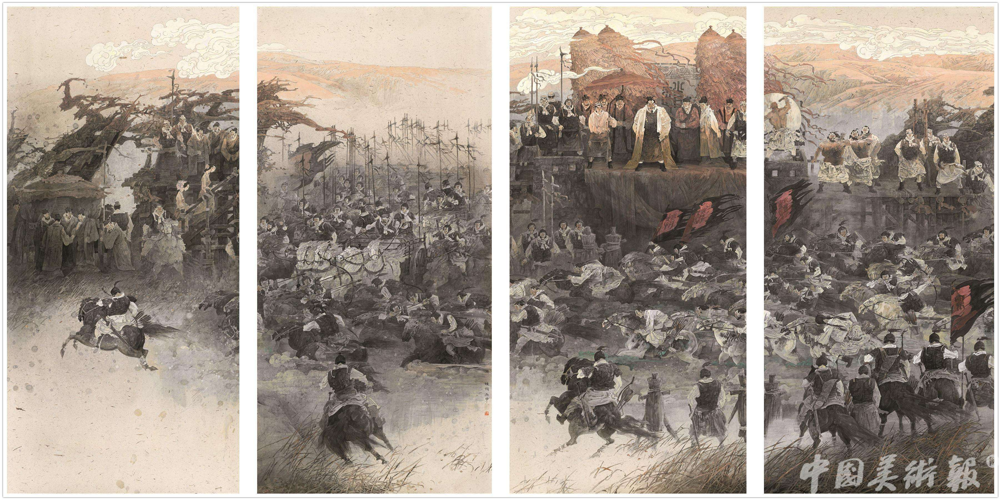

<!DOCTYPE html>
<html lang="en">
<head>
    <meta charset="UTF-8">
    <meta name="viewport" content="width=device-width, initial-scale=1.0">
    <meta http-equiv="X-UA-Compatible" content="ie=edge">
    <title>浅述唐宋元明清</title>
    <meta name="description" content="历史" />
    <meta name="keywords" content="一二三 木头人" />
    
    
    </script>
    <!-- <link rel="stylesheet" href="./css/index.css">
    <link rel="shortcut icon" href="./favicon.ico" /> -->
</head>
<body>
    

        0
        1
        2
        3
    

    

        
此处换肤

        

            <ul class="pifu">
                <li></li>
                <li></li>
                <li></li>
                <li></li>
                <li></li>
            </ul>
        

    

    

        广告位
        <i class="close-btn">×</i>
    

    

        <a class="goBack" href="javascript:scroll(0,0)">返回顶部</a>
    

    

        <ul class="caidang">
            <li><a href="./tang.html" target="_blank">唐&gt;</a></li>
            <li><a href="./song.html" target="_blank">宋&gt;</a></li>
            <li><a href="./yuan.html" target="_blank">元&gt;</a></li>
            <li><a href="./ming.html" target="_blank">明&gt;</a></li>
            <li><a href="./qing.html" target="_blank">清&gt;</a></li>
        </ul>
    

    

    

        

            <h3>中国五朝</h3>
            <ul>
                <li><a href="https://baike.baidu.com/item/唐朝/53699" target="_blank">唐</a></li>
                <li><a href="https://baike.baidu.com/item/宋朝/2919" target="_blank">宋</a></li>
                <li><a href="https://baike.baidu.com/item/元朝/266205" target="_blank">元</a></li>
                <li><a href="https://baike.baidu.com/item/%E6%98%8E%E6%9C%9D/141291" target="_blank">明</a></li>
                <li> <a href="https://baike.baidu.com/item/%E6%B8%85%E6%9C%9D/175141" target="_blank">清</a></li>
            </ul>
        

        

            

                <a href="javascript:;" class="zuo">&lt;</a>
                <ul class="images">
                    <li></li>
                    <li></li>
                    <li></li>
                    <li></li>
                </ul>
                <a href="javascript:;" class="you">&gt;</a>
                <ul class="circle">
                </ul>
            

        

    

    

    

        

            

                
<strong>唐诗</strong>

                <a href="https://so.gushiwen.org/shiwenv_45c396367f59.aspx" target="_blank">行宫</a>(元稹)
                <a href="https://so.gushiwen.org/shiwenv_c90ff9ea5a71.aspx" target="_blank">登鹳雀楼</a>(王之涣)
                <a href="https://so.gushiwen.org/shiwenv_5917bc6dca91.aspx" target="_blank">新嫁娘词</a>(王建)
                <a href="https://so.gushiwen.org/shiwenv_f324eea45183.aspx" target="_blank">相思</a>(王维)
                <a href="https://so.gushiwen.org/shiwenv_8d889937d1fe.aspx" target="_blank">杂诗</a>(王维)
                <a href="https://so.gushiwen.org/shiwenv_e9b1a8b4def0.aspx" target="_blank">鹿柴</a>(王维)
                <a href="https://so.gushiwen.org/shiwenv_4809b5e7a16a.aspx" target="_blank">竹里馆</a>(王维)
                <a href="https://so.gushiwen.org/shiwenv_6368d3d62fcd.aspx" target="_blank">山中送别</a>(王维)
                <a href="https://so.gushiwen.org/shiwenv_d09fef17613b.aspx" target="_blank">问刘十九</a>(白居易)
                <a href="https://so.gushiwen.org/shiwenv_94eb5d41fec6.aspx" target="_blank">哥舒歌</a>(西鄙人)
                <a href="https://so.gushiwen.org/shiwenv_c35a60c1a8e2.aspx" target="_blank">静夜思</a>(李白)
                <a href="https://so.gushiwen.org/shiwenv_68fe1f940020.aspx" target="_blank">怨情</a>(李白)
                <a href="https://so.gushiwen.org/shiwenv_ee9af27de9f2.aspx" target="_blank">登乐游原</a>(李商隐)
                <a href="https://so.gushiwen.org/shiwenv_ed8b644fd298.aspx" target="_blank">听筝</a>(李端)
                <a href="https://so.gushiwen.org/shiwenv_4f7e2f94ec4a.aspx" target="_blank">渡汉江</a>(宋之问)
                <a href="https://so.gushiwen.org/shiwenv_9cee4425b019.aspx" target="_blank">八阵图</a>(杜甫)
                <a href="https://so.gushiwen.org/shiwenv_63d3ff8f6b61.aspx" target="_blank">宿建德江</a>(孟浩然)
                <a href="https://so.gushiwen.org/shiwenv_ccee5691ba93.aspx" target="_blank">春晓</a>(孟浩然)
                <a href="https://so.gushiwen.org/shiwenv_11889cf7beab.aspx" target="_blank">春怨</a>(金昌绪)
                <a href="https://so.gushiwen.org/shiwenv_58313be2d918.aspx" target="_blank">江雪</a>(柳宗元)
                <a href="https://so.gushiwen.org/shiwenv_0f23fdb7b5f9.aspx" target="_blank">秋夜寄邱员外</a>(韦应物)
                <a href="https://so.gushiwen.org/shiwenv_038457ce8c4e.aspx" target="_blank">终南望余雪</a>(祖咏)
                <a href="https://so.gushiwen.org/shiwenv_054c756406d6.aspx" target="_blank">宫词</a>(张祜)
                <a href="https://so.gushiwen.org/shiwenv_40954072f541.aspx" target="_blank">寻隐者不遇</a>(贾岛)
                <a href="https://so.gushiwen.org/shiwenv_dbbccf73624e.aspx" target="_blank">送崔九</a>(裴迪)
                <a href="https://so.gushiwen.org/shiwenv_214bea9d63ff.aspx" target="_blank">送灵澈上人</a>(刘长卿)
                <a href="https://so.gushiwen.org/shiwenv_8430c8ce3d9c.aspx" target="_blank">听弹琴</a>(刘长卿)
                <a href="https://so.gushiwen.org/shiwenv_862f59a02a57.aspx" target="_blank">送上人</a>(刘长卿)
                <a href="https://so.gushiwen.org/shiwenv_26e5d8ef07d7.aspx" target="_blank">玉台体</a>(权德舆)
            

            

                
<strong>宋词</strong>

                <a href="https://so.gushiwen.org/shiwenv_cd236de1e210.aspx" target="_blank">武陵春·春晚</a>(李清照)
                <a href="https://so.gushiwen.org/shiwenv_3e33bfbb8f79.aspx"
                        target="_blank">如梦令·常记溪亭日暮</a>(李清照)
                <a href="https://so.gushiwen.org/shiwenv_3ffd5d0653a9.aspx"
                        target="_blank">如梦令·昨夜雨疏风骤</a>(李清照)
                <a href="https://so.gushiwen.org/shiwenv_2ee36eb2ccf7.aspx"
                        target="_blank">丑奴儿·书博山道中壁</a>(辛弃疾)
                <a href="https://so.gushiwen.org/shiwenv_d5ac0bd52789.aspx" target="_blank">钗头凤·红酥手</a>(陆游)
                <a href="https://so.gushiwen.org/shiwenv_324219410b89.aspx"
                        target="_blank">醉花阴·薄雾浓云愁永</a>(李清照)
                <a href="https://so.gushiwen.org/shiwenv_d096804a25ff.aspx"
                        target="_blank">卜算子·我住长江头</a>(李之仪)
                <a href="https://so.gushiwen.org/shiwenv_0bfac067dd8e.aspx" target="_blank">苏幕遮·怀旧</a>(范仲淹)
                <a href="https://so.gushiwen.org/shiwenv_f547ff97e13f.aspx"
                        target="_blank">渔家傲·天接云涛连晓</a>(李清照)
                <a href="https://so.gushiwen.org/shiwenv_b827b3f18b38.aspx"
                        target="_blank">蝶恋花·庭院深深深几</a>(欧阳修)
                <a href="https://so.gushiwen.org/shiwenv_c616fab1b377.aspx" target="_blank">生查子·元夕</a>(欧阳修)
                <a href="https://so.gushiwen.org/shiwenv_06df643b48ef.aspx"
                        target="_blank">水龙吟·登建康赏心亭</a>(辛弃疾)
                <a href="https://so.gushiwen.org/shiwenv_4d2028af6aed.aspx"
                        target="_blank">西江月·世事一场大梦</a>(苏轼)
                <a href="https://so.gushiwen.org/shiwenv_10a63215ee69.aspx" target="_blank">虞美人·听雨</a>(蒋捷)
                <a href="https://so.gushiwen.org/shiwenv_f44e79379dd7.aspx" target="_blank">钗头凤·世情薄</a>(唐婉)
                <a href="https://so.gushiwen.org/shiwenv_264d7fe426e8.aspx"
                        target="_blank">诉衷情·当年万里觅封</a>(陆游)
                <a href="https://so.gushiwen.org/shiwenv_47c89d71e6be.aspx"
                        target="_blank">临江仙·梦后楼台高锁</a>(晏几道)
                <a href="https://so.gushiwen.org/shiwenv_61aafc0a47a9.aspx"
                        target="_blank">水龙吟·次韵章质夫杨</a>(苏轼)
            

            

                
<strong>元曲</strong>

                <a href="https://so.gushiwen.org/shiwenv_9dcf133d25cc.aspx" target="_blank">天净沙·秋思</a>(马致远)
                <a href="https://so.gushiwen.org/shiwenv_e880525df22e.aspx" target="_blank">天净沙·秋</a>(白朴)
                <a href="https://so.gushiwen.org/shiwenv_1bd53945715b.aspx"
                        target="_blank">山坡羊·潼关怀古</a>(张养浩)
                <a href="https://so.gushiwen.org/shiwenv_695d093e1180.aspx" target="_blank">天净沙·春</a>(白朴)
                <a href="https://so.gushiwen.org/shiwenv_c439b578d976.aspx" target="_blank">折桂令·春情</a>(徐再思)
                <a href="https://so.gushiwen.org/shiwenv_dff01ff4925b.aspx" target="_blank">朝天子·咏喇叭</a>(王磐)
                <a href="https://so.gushiwen.org/shiwenv_1ba6bb1f525d.aspx" target="_blank">天净沙·夏</a>(白朴)
                <a href="https://so.gushiwen.org/shiwenv_257be0e7811c.aspx" target="_blank">天净沙·冬</a>(白朴)
                <a href="https://so.gushiwen.org/shiwenv_614c91077b60.aspx"
                        target="_blank">山坡羊·骊山怀古</a>(张养浩)
                <a href="https://so.gushiwen.org/shiwenv_39ad02580f79.aspx" target="_blank">水仙子·夜雨</a>(徐再思)
                <a href="https://so.gushiwen.org/shiwenv_abc05662aed6.aspx"
                        target="_blank">人月圆·山中书事</a>(张可久)
                <a href="https://so.gushiwen.org/shiwenv_5918027731dc.aspx" target="_blank">终身误</a>(曹雪芹)
                <a href="https://so.gushiwen.org/shiwenv_11dddffb4c2f.aspx" target="_blank">游园</a>(汤显祖)
                <a href="https://so.gushiwen.org/shiwenv_7ec399ee11b1.aspx" target="_blank">天净沙·即事</a>(乔吉)
                <a href="https://so.gushiwen.org/shiwenv_00336ce41916.aspx"
                        target="_blank">寿阳曲·江天暮雪</a>(马致远)
                <a href="https://so.gushiwen.org/shiwenv_a9d29f6816f4.aspx" target="_blank">天净沙·秋</a>(朱庭玉)
                <a href="https://so.gushiwen.org/shiwenv_5b5839840693.aspx" target="_blank">卖花声·怀古</a>(张可久)
                <a href="https://so.gushiwen.org/shiwenv_9976b9da5244.aspx" target="_blank">胡笳十八拍</a>(蔡文姬)
                <a href="https://so.gushiwen.org/shiwenv_ffc5956b3eba.aspx"
                        target="_blank">人月圆·重冈已隔红尘</a>(元好问)
                <a href="https://so.gushiwen.org/shiwenv_d29dc9e1b710.aspx" target="_blank">得胜乐·夏</a>(白朴)
            

            

                
<strong>明清小说</strong>

                <ul>
                    

                        

                        <dl>
                            <a
                                    href="http://www.mzhu8.com/book/2133/index.html"
                                    style="font-size: 16px;margin-left: 10px;margin-right: 10px;font-weight: bold;">浮生六记&nbsp;&nbsp;&nbsp;作者：[清]沈复</a>
                            
                            <dt style="margin-top: 8px;">&nbsp;&nbsp;&nbsp;&nbsp;文章简介：</dt>
                            <dt style="margin-top: 8px;"><a class="l_con"
                                    style="color: #000;">清人沈复以其家居生活和浪游见闻为内容写成的《浮生六记》，为中国文学史上的一支奇葩。该书在他的生前只有抄本流传，且传布不广，直到光绪三年杨引传首次发现的时候，只残留有前四记。
                                    可喜的是，最近有收藏者发现了沈复同时代人、清代著名学者钱泳的《记事珠》手...</a></dt>
                        </dl>
                        

                    

                    

                        

                        <dl>
                            <a
                                    href="http://www.mzhu8.com/book/2102/index.html"
                                    style="font-size: 16px;margin-left: 10px;margin-right: 10px;font-weight: bold;">三言二拍合集(珍藏本)&nbsp;&nbsp;&nbsp;作者：[明]冯梦龙;[明]凌濛</a>
                            
                            <dt style="margin-top: 8px;">&nbsp;&nbsp;&nbsp;&nbsp;文章简介：</dt>
                            <dt style="margin-top: 8px;"><a class="l_con"
                                    style="color: #000;">明朝后期是一个色彩鲜明的时代，逾越礼制、张扬个性是那个时代鲜明的特征，这种世风不可避免地影响了文学创作，于是描写五光十色的市井生活及人情世态的白话短篇小说集“三言二拍”便横空出世了。“三言”指《喻世明言》、《警世通言》、《醒世恒言》，“二拍”指《初...</a>
                            </dt>
                        </dl>
                        

                    

                    

                        

                        <dl>
                            <a
                                    href="http://www.mzhu8.com/book/1794/index.html"
                                    style="font-size: 16px;margin-left: 10px;margin-right: 10px;font-weight: bold;">药性歌括四百味&nbsp;&nbsp;&nbsp;&nbsp;作者：龚廷贤</a>
                            
                            <dt style="margin-top: 8px;">&nbsp;&nbsp;&nbsp;&nbsp;文章简介：</dt>
                            <dt style="margin-top: 8px;"><a class="l_con"
                                    style="color: #000;">《药性歌括四百味》是一本阐释性读物，是明代医家龚廷贤所著。每味药物下分原文、注释、语译、按语四个部分。全书以现代语言对每味药物的品种、来源、产地、药性、功能主治、临床应用、用法用量、使用注意事项等内容进行了全面的阐释。内容简明扼要，通俗易懂，实用性...</a>
                            </dt>
                        </dl>
                        

                    

                    

                        

                        <dl>
                            <a
                                    href="http://www.mzhu8.com/book/1771/index.html"
                                    style="font-size: 16px;margin-left: 10px;margin-right: 10px;font-weight: bold;">新平妖传&nbsp;&nbsp;&nbsp;&nbsp;作者：冯梦龙</a>
                            
                            <dt style="margin-top: 8px;">&nbsp;&nbsp;&nbsp;&nbsp;文章简介：</dt>
                            <dt style="margin-top: 8px;"><a class="l_con"
                                    style="color: #000;">全名《墨憨斋批点北宋三遂平妖传》。章回小说。明罗贯中编著，冯梦龙增补。四十回。书成于明泰昌元年。系依据罗贯中的《三遂平妖传》改编而成。除文字改动外，加了二十回，把每个人物的来龙去脉交代清楚。白猿被罚往白云洞守护天书。圣姑乃左黜的母亲，带领左黜和女儿...</a>
                            </dt>
                        </dl>
                        

                    

                    

                        

                        <dl>
                            <a
                                    href="http://www.mzhu8.com/book/1605/index.html"
                                    style="font-size: 16px;margin-left: 10px;margin-right: 10px;font-weight: bold;">儿女英雄传&nbsp;&nbsp;&nbsp;&nbsp;作者：文康</a>
                            
                            <dt style="margin-top: 8px;">&nbsp;&nbsp;&nbsp;&nbsp;文章简介：</dt>
                            <dt style="margin-top: 8px;"><a class="l_con"
                                    style="color: #000;">《儿女英雄传》是由清代满族文学家文康所著，又名《金玉缘》、《日下新书》，是中国小说史上最早出现的一部熔侠义与言情于一炉的社会小说，小说长达40回，讲述的是安学海父子仕途生活，描绘了整个社会特别是官场的腐败和黑暗。以其独特的艺术魅力赢得广大读者的好评，...</a>
                            </dt>
                        </dl>
                        

                    

                    

                        

                        <dl>
                            <a
                                    href="http://www.mzhu8.com/book/1599/index.html"
                                    style="font-size: 16px;margin-left: 10px;margin-right: 10px;font-weight: bold;">彭公案&nbsp;&nbsp;&nbsp;&nbsp;作者：贪梦道人</a>
                            
                            <dt style="margin-top: 8px;">&nbsp;&nbsp;&nbsp;&nbsp;文章简介：</dt>
                            <dt style="margin-top: 8px;"><a class="l_con"
                                    style="color: #000;">《彭公案》，是中国清朝末年的公案小说，作者贪梦道人。“彭公”指的是清朝康熙年间的循吏彭鹏。全书共341回。书中大部份情节实属虚构，描述了彭公在江湖豪侠的帮助下，如何惩治贪官恶霸、绿林草寇的故事。塑造了李七侯、黄三太、杨香武、欧阳德一批侠义之士的形象。...</a>
                            </dt>
                        </dl>
                        

                    

                    

                        

                        <dl>
                            <a
                                    href="http://www.mzhu8.com/book/1598/index.html"
                                    style="font-size: 16px;margin-left: 10px;margin-right: 10px;font-weight: bold;">三侠剑&nbsp;&nbsp;&nbsp;&nbsp;作者：张杰鑫</a>
                            
                            <dt style="margin-top: 8px;">&nbsp;&nbsp;&nbsp;&nbsp;文章简介：</dt>
                            <dt style="margin-top: 8px;"><a class="l_con"
                                    style="color: #000;">《三侠剑》，由清末民国艺人张杰鑫根据《施公案》和《彭公案》改编的评书作品，属于长篇武侠小说。《三侠剑》，长篇武侠小说，由清末民国艺人张杰鑫根据《施公案》和《彭公案》改编的评书作品。讲述清康熙年间，黄天霸的先人们以胜英为首的侠客们替天行道，扬善除恶，...</a>
                            </dt>
                        </dl>
                        

                    

                </ul>
            

        

        

            

                
            

            

                
            

            

                
            

            

                
            

            

                
            

            

                
            

            

                

                    <ul class="msg1" id="msg1">
                        <li class="firstnew">如梦令·常记溪亭日暮</li>
                        <li>醉花阴·薄雾浓云愁永</li>
                        <li>丑奴儿·书博山道中壁</li>
                        <li>山坡羊·骊山怀古</li>
                        <li>西江月·世事一场大梦</li>
                        <li>水龙吟·次韵章质夫杨</li>
                        <li>寿阳曲·江天暮雪</li>
                        <li>卜算子·我住长江头</li>
                        <li>人月圆·重冈已隔红尘</li>
                        <li>蝶恋花·庭院深深深几</li>
                        <li>醉花阴·薄雾浓云愁永</li>
                        <li>丑奴儿·书博山道中壁</li>
                        <li>山坡羊·骊山怀古</li>
                        <li>西江月·世事一场大梦</li>
                        <li>水龙吟·次韵章质夫杨</li>
                        <li>寿阳曲·江天暮雪</li>
                        <li>卜算子·我住长江头</li>
                        <li>人月圆·重冈已隔红尘</li>
                        <li>蝶恋花·庭院深深深几</li>
                        <li>醉花阴·薄雾浓云愁永</li>
                        <li>丑奴儿·书博山道中壁</li>
                        <li>山坡羊·骊山怀古</li>
                        <li>西江月·世事一场大梦</li>
                        <li>水龙吟·次韵章质夫杨</li>
                        <li>寿阳曲·江天暮雪</li>
                        <li>卜算子·我住长江头</li>
                        <li>人月圆·重冈已隔红尘</li>
                        <li>蝶恋花·庭院深深深几</li>
                    </ul>
                    <ul id="msg2"></ul>
                

            

        

    

    

        
友情链接

        

        
<a href="https://www.gushiwen.org/">古诗词网站</a> <a href="http://www.mzhu8.com/">名著阅读网</a>

        <a href="http://www.taobao.com">淘宝网</a>
        <a href="http://www.tmall.com">天猫</a>
        <a href="http://ju.taobao.com">飞猪</a>
        <a href="https://taoxiaopu.taobao.com/">高德</a>
        <a href="http://www.uc.cn/">UC</a>
        <a href="http://www.baidu.com/">百度</a>
        <a href="http://www.umeng.com/">大麦网</a>
        <a href="https://www.alipay.com">支付宝</a>
        <a href="http://www.youku.com/">优酷</a>
        

            本站所有照片和作品皆为转载，版权归作者所有
        

    

</body>

</html>
