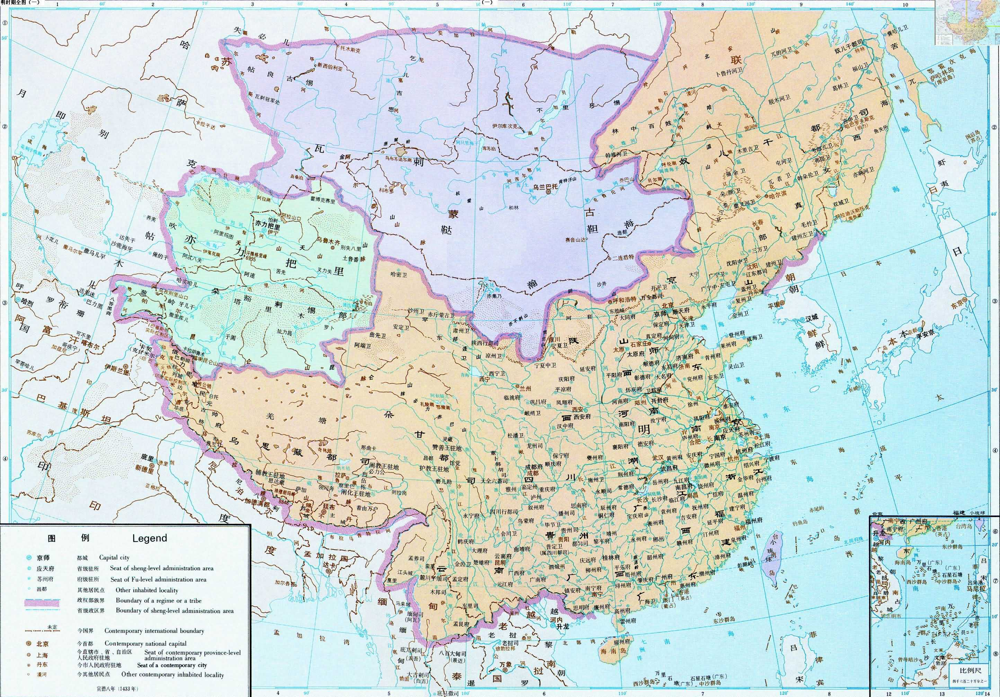

<!DOCTYPE html>
<html lang="en">
<head>
    <meta charset="UTF-8">
    <meta name="viewport" content="width=device-width, initial-scale=1.0">
    <title>明朝</title>
    <link rel="stylesheet" href="./css/dynasty.css">
    
    <link rel="shortcut icon" href="./favicon.ico" />
</head>
<body>
    

        

            
明

            

                <ul>
                    <li>HOME</li>
                    <li>ABOUT</li>
                    <li>introduce</li>
                    <li>team</li>
                    <li>register</li>
                </ul>
            

        

        
    

    

        

            
            

        

        

            
        

    

    

        

            
        

        

            <h2>政治</h2>
            

                1381年，朱元璋罢中书省，废丞相，亲理政务，
                但是力不从心，故设立四辅官来辅佐政事，但这项制度效能不彰，1382年七月被废。十一月，仿宋制，置华盖殿、武英殿、文渊阁、
                东阁诸大学士
                ，又设文华殿大学士，以辅导太子，品秩皆为正五品。朱棣登基后，特派解缙、胡广、杨荣等入午门值文渊阁，参预机务，由此成立内阁。

        

    

    

        

            
        

        

            <h2>宋朝皇帝列表</h2>
            

                <a href="http://www.qulishi.com/renwu/songtaizu/" target="_blank">宋太祖赵匡胤</a>&nbsp; --&nbsp;
                <a href="http://www.qulishi.com/renwu/songtaizong/" target="_blank">宋太宗赵光义</a>&nbsp;--&nbsp;
                <a href="http://www.qulishi.com/renwu/songzhenzong/" target="_blank">宋真宗赵恒</a>&nbsp;--&nbsp;
                <a href="http://www.qulishi.com/renwu/songrenzong/" target="_blank">宋仁宗赵祯</a>&nbsp;--&nbsp;
                <a href="http://www.qulishi.com/renwu/songyingzong/" target="_blank">宋英宗赵曙</a>&nbsp;--&nbsp;
                <a href="http://www.qulishi.com/renwu/songshenzong/" target="_blank">宋神宗赵顼</a>&nbsp;--&nbsp;
                <a href="http://www.qulishi.com/renwu/songzhezong/" target="_blank">宋哲宗赵煦</a>&nbsp; --&nbsp;
                <a href="http://www.qulishi.com/renwu/songhuizong/" target="_blank">宋徽宗赵佶</a>&nbsp;--&nbsp;
                <a href="http://www.qulishi.com/renwu/songqinzong/" target="_blank">宋钦宗赵桓</a>&nbsp; --&nbsp;
                <a href="http://www.qulishi.com/renwu/zhaogou/" target="_blank">宋高宗赵构</a>&nbsp;--&nbsp;
                <a href="http://www.qulishi.com/renwu/songxiaozong/" target="_blank">宋孝宗赵昚</a>&nbsp;--
                <a href="http://www.qulishi.com/renwu/songguangzong/" target="_blank">宋光宗赵惇</a>&nbsp;--&nbsp;
                <a href="http://www.qulishi.com/renwu/songningzong/" target="_blank">宋宁宗赵扩</a>&nbsp; --&nbsp;
                <a href="http://www.qulishi.com/renwu/songlizong/" target="_blank">宋理宗赵昀</a>&nbsp;--&nbsp;
                <a href="http://www.qulishi.com/renwu/songduzong/" target="_blank">宋度宗赵禥</a>&nbsp; --&nbsp;
                <a href="http://www.qulishi.com/renwu/songgongdi/" target="_blank">宋恭帝赵隰</a>&nbsp;--&nbsp;
                <a href="http://www.qulishi.com/news/201304/471.html" target="_blank">宋端宗赵昰</a>&nbsp;--
                <a href="http://www.qulishi.com/news/201304/472.html" target="_blank">宋卫王赵昺</a>
            

        

    

    

        

            
        

        

            <h2>行政区划</h2>
            

                1376年改行省为承宣布政使司，但习惯上仍称“省”。1370年于各省设置一都卫，1375年改为都指挥使司。
                1427年弃安南后，明朝在全国设置两京十三布政使司。
                共设置十六都司、五行都司、二留守司。其中十三个是与布政使司同名的都司，
                其它三个是万全都司、大宁都司和辽东都司。
            

        

    

    

        

            

                
                

                    <h4>文物</h4>
                    
                    
MINGCHAO

                

            

            

                
                

                    <h4>文物</h4>
                    
                    
MINGCHAO

                

            

            

                
                

                    <h4>文物</h4>
                    
                    
MINGCHAO

                

            

            

                
                

                    <h4>文物</h4>
                    
                    
MINGCHAO

                

            

            
 

        

        

            

                <h4>LATEST FROM HISTORY</h4>
                
Strict rules and law

            

        

        

            

                
                

                    <h4>文物</h4>
                    
                    
MINGCHAO

                

            

            

                
                

                    <h4>文物</h4>
                    
                    
MINGCHAO

                

            

            

                
                

                    <h4>文物</h4>
                    
                    
MINGCHAO

                

            

            

                
                

                    <h4>文物</h4>
                    
                    
MINGCHAO

                

            

            
 

        

        

            <a href="#">SEE ALL</a>
        

    

    

        

            <h3>historical figure</h3>
            
            
The most representative person of this dynasty 

        

        

            

                
            

            

                
            

            

                
            

        

        

            

                <a href="https://baike.baidu.com/item/%E7%8E%8B%E5%AE%88%E4%BB%81/503207?fromtitle=%E7%8E%8B%E9%98%B3%E6%98%8E&fromid=5710"
                    style="height: 100%;width: 100%;">王阳明</a>
            

            

                <a href="https://baike.baidu.com/item/%E4%BA%8E%E8%B0%A6/377" style="height: 100%;width: 100%;">于谦</a>
            

            

                <a href="https://baike.baidu.com/item/%E5%BE%90%E6%B8%AD/18002" style="height: 100%;width: 100%;">徐渭</a>
            

        

    

    

        

            

                <h3>意见反馈</h3>
                <form>
                    <input type="text" value="Your Name" onfocus="this.value = '';"
                        onblur="if (this.value == '') {this.value = 'Your Name';}" class="com3">
                    <input type="text" value="Enter Email" onfocus="this.value = '';"
                        onblur="if (this.value == '') {this.value = 'Enter email';}" class="com3">
                    <textarea onfocus="this.value = '';" onblur="if (this.value == '') {this.value = 'Enter Text';}"
                        class="com3">Enter Text</textarea>
                    

                        <input type="submit" value="Send">
                    

                </form>
            

        

    

    

        

            

                
Copyright @ 2020.CaoSen 2971

            

            
 

        

    

</body>
</html>