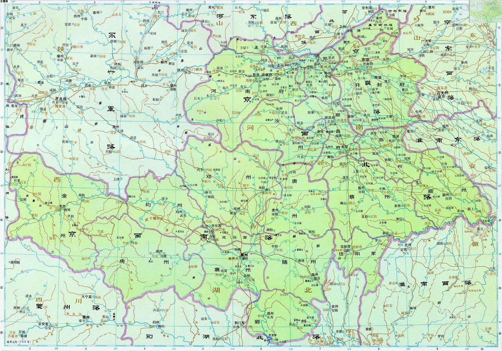

<!DOCTYPE html>
<html lang="en">
<head>
    <meta charset="UTF-8">
    <meta name="viewport" content="width=device-width, initial-scale=1.0">
    <title>宋朝</title>
    <link rel="stylesheet" href="./css/dynasty.css">
    
    <link rel="shortcut icon" href="./favicon.ico" />
</head>
<body>
    

        

            
宋

            

                <ul>
                    <li>HOME</li>
                    <li>ABOUT</li>
                    <li>introduce</li>
                    <li>team</li>
                    <li>register</li>
                </ul>
            

        

        
    

    

        

            
            

        

        

            
        

    

    

        

            
        

        

            <h2>政治</h2>
            

                宋朝的政治体制大体沿袭唐朝的政治制度。但宰相不再由三省长官担任，而是另以同中书门下平章事为宰相。又增设参知政事为副相，通称执政，与宰相合称“宰执”。宋朝的相权大幅萎缩，仅负责行政职能。中书门下与枢密院合称二府，掌文武大权。又设盐铁、户部、度支三司，主管财政大权，号称计省。这样三司、宰执、枢密使三权互相制衡，因此削弱了相权，加强了皇权。宋朝还在御史台之外增设谏院和置谏官，这些都是监察机构，负责弹劾等事宜。
            

        

    

    

        

            
        

        

            <h2>宋朝皇帝列表</h2>
            

                <a href="http://www.qulishi.com/renwu/songtaizu/" target="_blank">宋太祖赵匡胤</a>&nbsp; --&nbsp; <a
                    href="http://www.qulishi.com/renwu/songtaizong/" target="_blank">宋太宗赵光义</a>&nbsp;--&nbsp; <a
                    href="http://www.qulishi.com/renwu/songzhenzong/" target="_blank">宋真宗赵恒</a>&nbsp;--&nbsp; <a
                    href="http://www.qulishi.com/renwu/songrenzong/" target="_blank">宋仁宗赵祯</a>&nbsp;--&nbsp;<a
                    href="http://www.qulishi.com/renwu/songyingzong/" target="_blank">宋英宗赵曙</a>&nbsp;--&nbsp; <a
                    href="http://www.qulishi.com/renwu/songshenzong/" target="_blank">宋神宗赵顼</a>
                <a href="http://www.qulishi.com/renwu/songzhezong/" target="_blank">宋哲宗赵煦</a>&nbsp; --&nbsp;<a
                    href="http://www.qulishi.com/renwu/songhuizong/" target="_blank">宋徽宗赵佶</a>&nbsp;--&nbsp;<a
                    href="http://www.qulishi.com/renwu/songqinzong/" target="_blank">宋钦宗赵桓</a>&nbsp; --&nbsp;<a
                    href="http://www.qulishi.com/renwu/zhaogou/" target="_blank">宋高宗赵构</a>&nbsp;--&nbsp;<a
                    href="http://www.qulishi.com/renwu/songxiaozong/" target="_blank">宋孝宗赵昚</a>&nbsp;-- <a
                    href="http://www.qulishi.com/renwu/songguangzong/" target="_blank">宋光宗赵惇</a>
                <a href="http://www.qulishi.com/renwu/songningzong/" target="_blank">宋宁宗赵扩</a>&nbsp; --&nbsp;<a
                    href="http://www.qulishi.com/renwu/songlizong/" target="_blank">宋理宗赵昀</a>&nbsp;--&nbsp;<a
                    href="http://www.qulishi.com/renwu/songduzong/" target="_blank">宋度宗赵禥</a>&nbsp; --&nbsp;<a
                    href="http://www.qulishi.com/renwu/songgongdi/" target="_blank">宋恭帝赵隰</a>&nbsp;--&nbsp;<a
                    href="http://www.qulishi.com/news/201304/471.html" target="_blank">宋端宗赵昰</a>&nbsp;-- <a
                    href="http://www.qulishi.com/news/201304/472.html" target="_blank">宋卫王赵昺</a>
            

        

    

    

        

            
        

        

            <h2>行政区划</h2>
            

                宋朝汲取了唐朝藩镇割据的教训，一级行政区划改为“路”。至道三年（997年）始定为十五路，包括京东、京西、河北、河东、
                陕西、淮南、江南、荆湖南、荆湖北、两浙、福建、西川、峡、广南东、广南西五路。咸平四年（1001年）分西川为利州、益
                州二路，分峡路为夔州、梓州二路。天禧四年（1020年）分江南路为江南东、西二路。
            

        

    

    

        

            

                
                

                    <h4>文物</h4>
                    
                    
SONGCHAO

                

            

            

                
                

                    <h4>文物</h4>
                    
                    
SONGCHAO

                

            

            

                
                

                    <h4>文物</h4>
                    
                    
SONGCHAO

                

            

            

                
                

                    <h4>文物</h4>
                    
                    
SONGCHAO

                

            

            
 

        

        

            

                <h4>LATEST FROM HISTORY</h4>
                
Strict rules and law

            

        

        

            

                
                

                    <h4>文物</h4>
                    
                    
SONGCHAO

                

            

            

                
                

                    <h4>文物</h4>
                    
                    
SONGCHAO

                

            

            

                
                

                    <h4>文物</h4>
                    
                    
SONGCHAO

                

            

            

                
                

                    <h4>文物</h4>
                    
                    
SONGCHAO

                

            

            
 

        

        

            <a href="#">SEE ALL</a>
        

    

    

        

            <h3>historical figure</h3>
            
            
The most representative person of this dynasty 

        

        

            

                
            

            

                
            

            

                
            

        

        

            

                <a href="https://baike.baidu.com/item/%E8%BE%9B%E5%BC%83%E7%96%BE/134859"
                    style="height: 100%;width: 100%;">辛弃疾</a>
            

            

                <a href="https://baike.baidu.com/item/%E8%8B%8F%E8%BD%BC/53906" style="height: 100%;width: 100%;">苏轼</a>
            

            

                <a href="https://baike.baidu.com/item/%E8%8C%83%E4%BB%B2%E6%B7%B9/176112"
                    style="height: 100%;width: 100%;">范仲淹</a>
            

        

    

    

        

            

                <h3>意见反馈</h3>
                <form>
                    <input type="text" value="Your Name" onfocus="this.value = '';"
                        onblur="if (this.value == '') {this.value = 'Your Name';}" class="com3">
                    <input type="text" value="Enter Email" onfocus="this.value = '';"
                        onblur="if (this.value == '') {this.value = 'Enter email';}" class="com3">
                    <textarea onfocus="this.value = '';" onblur="if (this.value == '') {this.value = 'Enter Text';}"
                        class="com3">Enter Text</textarea>
                    

                        <input type="submit" value="Send">
                    

                </form>
            

        

    

    

        

            

                
Copyright @ 2020.CaoSen 2971

            

            
 

        

    

</body>
</html>