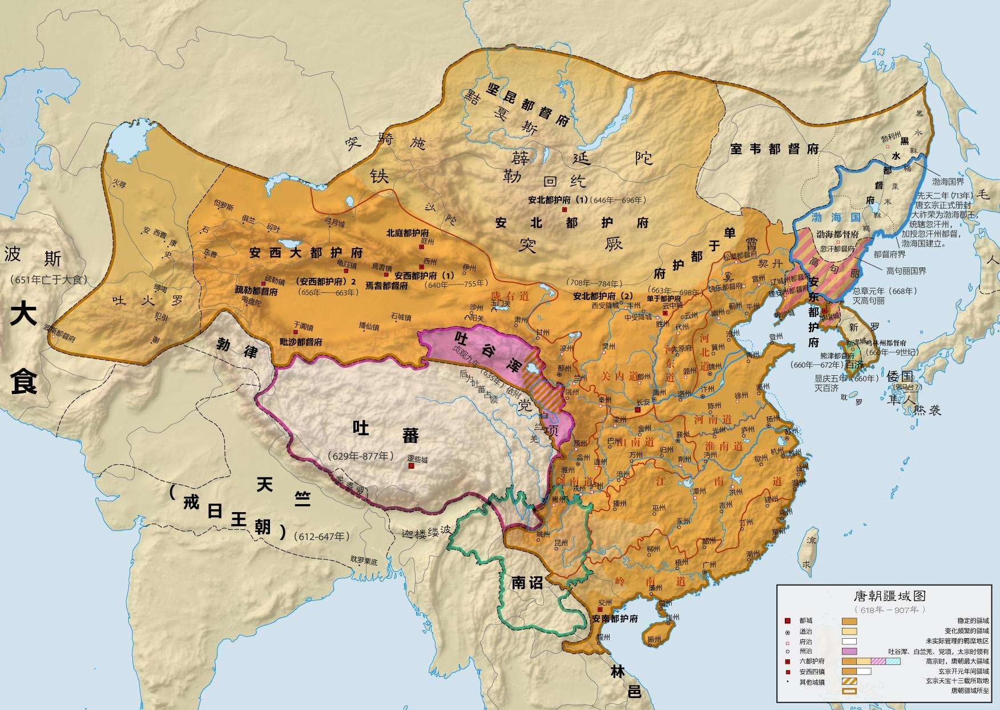

<!DOCTYPE html>
<html lang="en">
<head>
    <meta charset="UTF-8">
    <meta name="viewport" content="width=device-width, initial-scale=1.0">
    <title>唐朝</title>
    <link rel="stylesheet" href="./css/dynasty.css">
    
    <link rel="shortcut icon" href="./favicon.ico" />
</head>
<body>
    

        

            
唐

            

                <ul>
                    <li>HOME</li>
                    <li>ABOUT</li>
                    <li>introduce</li>
                    <li>team</li>
                    <li>register</li>
                </ul>
            

        

        
    

    

        

            
            

        

        

            
        

    

    

        

            
        

        

            <h2>疆域范围</h2>
            

                时中亚的绿洲地带受唐朝支配，其最大范围南至罗伏州（今属越南）、北括玄阙州（今属俄罗斯）、西及安息州（今属乌兹别克斯坦）、东临哥勿州（今吉林通化）的辽阔疆域，国土面积达1237万平方公里，又一说1076万平方公里。
                武周时期漠北陷落于后突厥，安史之乱后西域被吐蕃攻占，到晚唐时缩水至汉地，但仍保有河套地区。

        

    

    

        

            
        

        

            <h2>唐朝皇帝列表</h2>
            

                <a href="http://www.qulishi.com/renwu/liyuan/" target="_blank">唐高祖李渊</a>&nbsp; --&nbsp;
                <a href="http://www.qulishi.com/renwu/lishimin/" target="_blank">唐太宗李世民</a>&nbsp;--&nbsp; <a
                    href="http://www.qulishi.com/renwu/lizhi/" target="_blank">唐高宗李治</a>&nbsp;--&nbsp;
                <a href="http://www.qulishi.com/renwu/lixian/" target="_blank">唐中宗李显</a>&nbsp;--&nbsp;<a
                    href="http://www.qulishi.com/renwu/lidan/" target="_blank">唐睿宗李旦</a>&nbsp;--&nbsp;
                <a href="http://www.qulishi.com/renwu/wuzetian/" target="_blank">武则天</a>
                <a href="http://www.qulishi.com/renwu/lilongji/" target="_blank">唐玄宗李隆基</a>&nbsp;
                --&nbsp;<a href="http://www.qulishi.com/renwu/tangsuzong/" target="_blank">唐肃宗李亨</a>&nbsp;--&nbsp;<a
                    href="http://www.qulishi.com/renwu/tangdaizong/" target="_blank">唐代宗李豫</a>&nbsp;
                --&nbsp;<a href="http://www.qulishi.com/renwu/tangdezong/" target="_blank">唐德宗李适</a>&nbsp;--&nbsp;<a
                    href="http://www.qulishi.com/renwu/tangshunzong/" target="_blank">唐顺宗李诵</a>&nbsp;--
                <a href="http://www.qulishi.com/renwu/tangxianzong/" target="_blank">唐宪宗李纯</a>
                <a href="http://www.qulishi.com/renwu/tangmuzong/" target="_blank">唐穆宗李恒</a>&nbsp;
                --&nbsp;<a href="http://www.qulishi.com/renwu/tangjingzong/" target="_blank">唐敬宗李湛</a>&nbsp;--&nbsp;<a
                    href="http://www.qulishi.com/renwu/tangwenzong/" target="_blank">唐文宗李昂</a>&nbsp;
                --&nbsp;<a href="http://www.qulishi.com/renwu/tangwuzong/" target="_blank">唐武宗李炎</a>&nbsp;--&nbsp;<a
                    href="http://www.qulishi.com/renwu/tangxuanzong/" target="_blank">唐宣宗李忱</a>&nbsp;--
                <a href="http://www.qulishi.com/renwu/tangyizong/" target="_blank">唐懿宗李漼</a>
                <a href="http://www.qulishi.com/renwu/tangxizong/" target="_blank">唐僖宗李儇</a>&nbsp;
                --&nbsp;<a href="http://www.qulishi.com/renwu/tangzhaozong/" target="_blank">唐昭宗李晔</a>&nbsp;--&nbsp;<a
                    href="http://www.qulishi.com/renwu/tangaidi/" target="_blank">唐哀帝李柷</a>
            

        

    

    

        

            
        

        

            <h2>行政区划</h2>
            

                唐代开创了中国行政区史上道和府的建制。贞观元年（627年），唐太宗分天下为10道：关内、
                河南、河东、河北、山南、陇右、淮南、江南、剑南、岭南等十道，不过这些道没实际权力，唐代城市等级主要是总管府
                、都督府、节度使等，府以下为州、县。贞观十四年（640年），全国共设360州（府），下辖1557县。开元年间又将山南、江南各分东西，并增置京畿、都畿、黔中三道，形成十五道的格局。道设州、府，州、府下设县，开元末年，全国共有州、府三百二十八座，县一千五百七十三座。
            

        

    

    

        

            

                
                

                    <h4>文物</h4>
                    
                    
TANGCHAO

                

            

            

                
                

                    <h4>文物</h4>
                    
                    
TANGCHAO

                

            

            

                
                

                    <h4>文物</h4>
                    
                    
TANGCHAO

                

            

            

                
                

                    <h4>文物</h4>
                    
                    
TANGCHAO

                

            

            
 

        

        

            

                <h4>LATEST FROM HISTORY</h4>
                
Strict rules and law

            

        

        

            

                
                

                    <h4>文物</h4>
                    
                    
TANGCHAO

                

            

            

                
                

                    <h4>文物</h4>
                    
                    
TANGCHAO

                

            

            

                
                

                    <h4>文物</h4>
                    
                    
TANGCHAO

                

            

            

                
                

                    <h4>文物</h4>
                    
                    
TANGCHAO

                

            

            
 

        

        

            <a href="#">SEE ALL</a>
        

    

    

        

            <h3>historical figure</h3>
            
            
The most representative person of this dynasty 

        

        

            

                
            

            

                
            

            

                
            

        

        

            

                <a href="https://baike.baidu.com/item/%E6%9D%8E%E7%99%BD/1043?fr=aladdin"
                    style="height: 100%;width: 100%;">李白</a>
            

            

                <a href="https://baike.baidu.com/item/%E9%A2%9C%E7%9C%9F%E5%8D%BF/66560?fr=aladdin"
                    style="height: 100%;width: 100%;">颜真卿</a>
            

            

                <a href="https://baike.baidu.com/item/%E6%9D%9C%E7%94%AB/63508" style="height: 100%;width: 100%;">杜甫</a>
            

        

    

    

        

            

                <h3>意见反馈 </h3>
                <form>
                    <input type="text" value="Your Name" onfocus="this.value = '';"
                        onblur="if (this.value == '') {this.value = 'Your Name';}" class="com3">
                    <input type="text" value="Enter Email" onfocus="this.value = '';"
                        onblur="if (this.value == '') {this.value = 'Enter email';}" class="com3">
                    <textarea onfocus="this.value = '';" onblur="if (this.value == '') {this.value = 'Enter Text';}"
                        class="com3">Enter Text</textarea>
                    

                        <input type="submit" value="Send">
                    

                </form>
            

        

    

    

        

            

                
Copyright @ 2020.CaoSen 2971

            

            
 

        

    

</body>
</html>